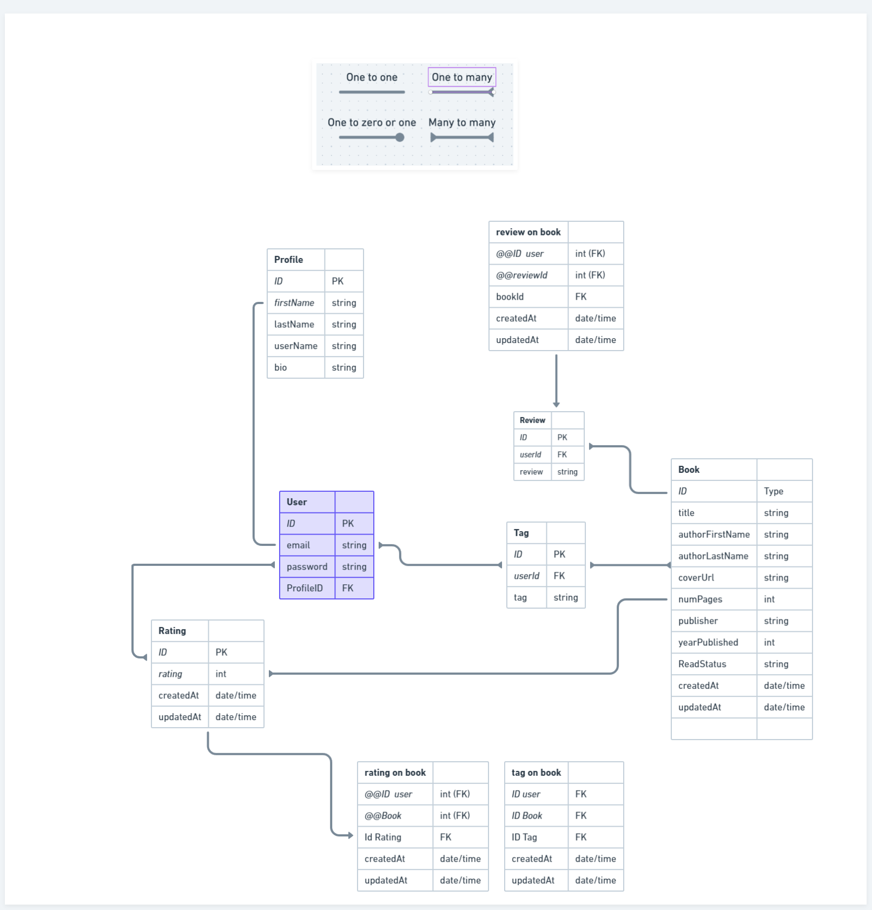

# BookStat Server side

## Available Scripts

For the client side app load, run: `npm run dev` in the project directory.

Open [http://localhost:4000](http://localhost:4000) to view it in your browser.

View API documentation by opening  `docs\index.html` with the live server

### Working DataFrame URL

Working model:
<https://whimsical.com/XcSU6FoUUS77x9cd2Wyape>

#### Books

1. add book
2. edit book
3. get all books
4. get book by id
5. delete book by id

TBD:

- route to fetch and delete book tags
- get books by title
- get books by read status
- allow for multiple authors to be registered
- add book description field

#### Users

1. create user
2. login user
3. get user by id
4. get all users

TBD:

- delete user by id
- edit user
- add profile*

*redesign user to include unique username

#### User-book

TBD:

- user can add book rating
- user can leave a review
- get all book reviews and author
